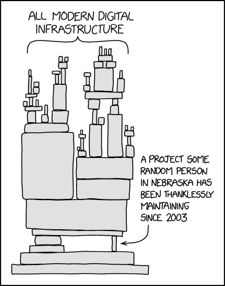

# Open Source Projects

Say you are an open source developer who is looking for a way to fund the continued development on your project. Rather than asking for donations you can ask for your community to lock assets into an Endaoment setup with you or your team as the beneficiary.

When it becomes time to hand over the project to another developer, you can just assign them as a new beneficiary.
